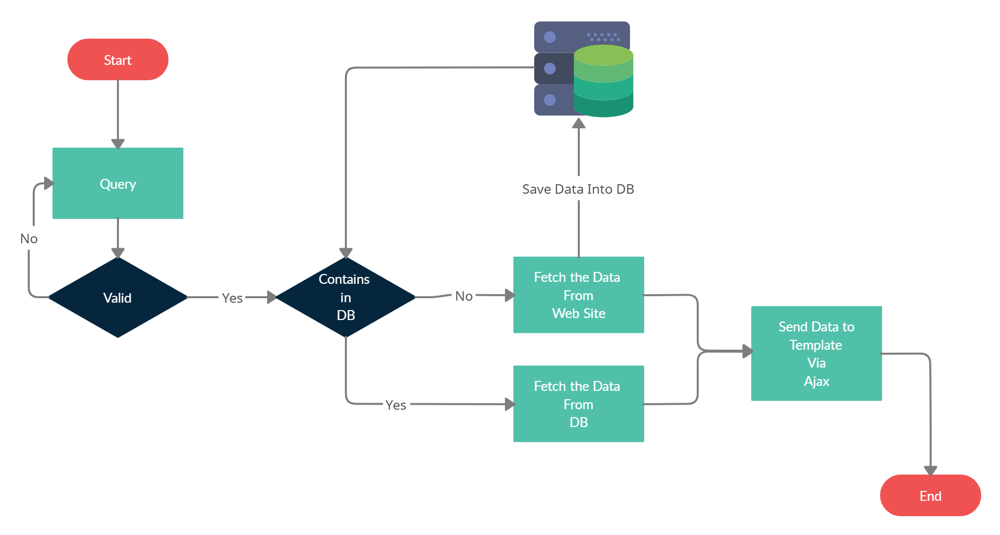
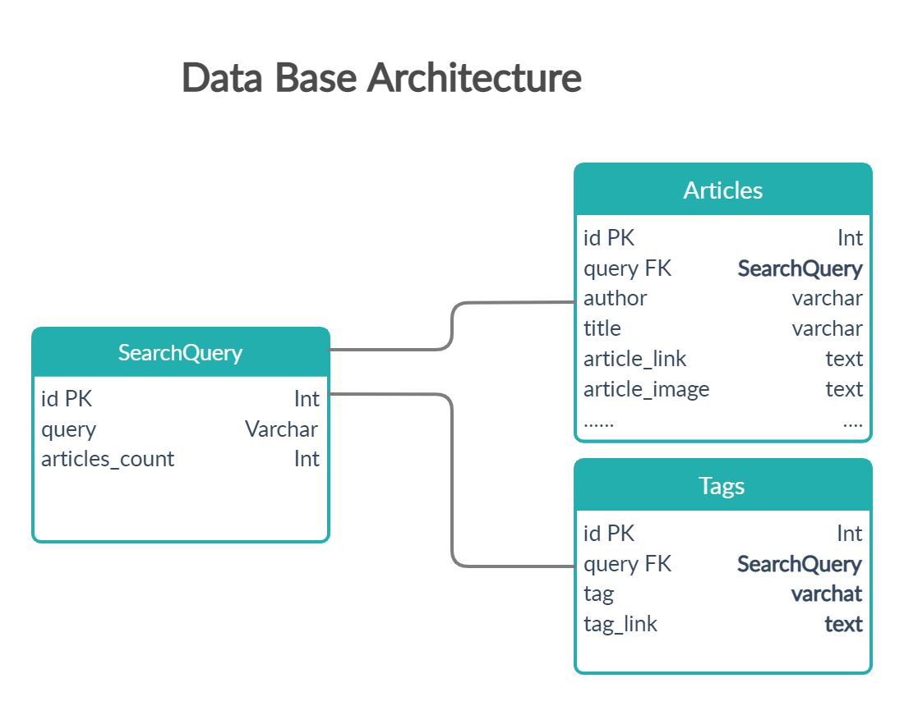

# django_web_scrapper

---

## Overview

This is a simple web app which is a demo of web scraping using Python. In this application I'm fetching data from [Medium](https://medium.com/). For faster Fetching I'm storing the fetched details into DataBase.

## Installation Intsructions

Activate virtual environment if you wish.

This app installation requires [PIP](https://pip.pypa.io/en/stable/).

Install the dependencies and start the server.

```sh
$ cd to/this/project/directory/
$ pip install -r requirements.txt
```

Running Server

```sh
$ python manage.py runserver
```

Verify the web app is working or not,  by navigating to your server address in your preferred browser.

```sh
127.0.0.1:8000
or
http://localhost:8000/
```

## Flow Chart



## Data Base Arch


